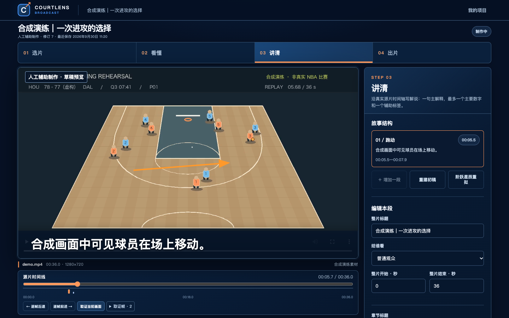

# CourtLens Broadcast · 深度赛场解说工作室

**把一次进攻看懂，再把它讲回比赛画面。**

面向 BroadcastCode「深度赛场」黑客松，重新设计的视频解说制作系统。输入单个比赛片段，建立视频证据、核对官方指标、编排少量解释节点，导出带战术箭头、中文字幕和可选中文配音的真实 MP4，并生成可独立观看的成片页面。

[打开公开演练网页](https://dingyucanada.github.io/courtlens-arena/) · 使用自制合成视频和数据，可进入交互回合演练。完整制作台需要按下文启动本地服务；比赛正式部署仍以 CloudFront 为准。

当前主产品是 **Broadcast**。历史 Arena 的可靠指标验证能力部分复用，旧工作流不再是新版使用前提。历史说明见 [Arena 4.1 存档](docs/Archive-Arena-4.1-README.md)。



[观看带中文配音的实际导出样片](docs/broadcast-assets/voiced-rehearsal.mp4)（合成演练素材，不是真实 NBA 比赛）。

## 本次真实比赛迭代

已在2025-01-01独行侠对火箭的48秒集锦上实际运行检测、比分牌读数、名单核对、故事编辑和StepFun配音，输出48秒带字幕与短时路线标注的MP4。检测处理240帧用时34.9秒，是本机单次测量；人物和战术仍经过AI编辑复核，**不是NBA生产级自动识别验收**。比赛原片和模型权重不随仓库分发。

新增基础技战术知识库、按日期过滤的球队资料、英文现场/普通话技战术/粤语讲波三种原创文本风格，以及随视频源时钟变化的当前章节和证据。普通话真实提议通过服务端校验；英文/粤语真实提议仍出现结构错误，属于实验文本模式，配音未验证。战术库用于有源帧依据的制作检索，尚未自动注入解说。详细结果与来源见[真实NBA验证](docs/Broadcast-真实NBA验证.md)、[CV实测](docs/Broadcast-CV-实测.md)、[表达研究](docs/Broadcast-解说表达研究.md)和[NBA 2K同步观赛取舍](docs/Broadcast-NBA2K与同步观赛.md)。

[新版产品与实测演示 PPT](docs/broadcast-assets/CourtLens-Real-NBA-20260930.pptx) · 8页，包含真实源帧、检测结果、实测配音时长图与AWS架构。限项目内部评审；正式比赛素材与发布许可待赛方下发。

## 开始使用

需要 Python 3.12、Node.js 24、FFmpeg / FFprobe 和中文字体。安装媒体依赖后启动：

```sh
python3 -m pip install -r requirements-media.txt -r requirements-cloud.txt
python3 tools/launch.py --port 8769
```

打开 [本机 Broadcast](http://127.0.0.1:8769/broadcast/)。默认项目文件保存在 `workspace/`，视频不会因本地使用而自动上传。只有明确运行已配置的模型提供者时，才按界面选择的范围发送素材。

## 制作流程

| 阶段 | 可以完成的实际工作 |
| --- | --- |
| 选片 | 上传视频，读取实际时长、帧时间与文件指纹，确认比赛背景和素材来源。 |
| 看懂 | 提取真实关键帧；接受、修正或拒绝观察；配置模型时运行视频理解。没有模型时可人工完成。 |
| 讲清 | 编辑 1–3 个解释节点，把官方事件指标绑定到正确球员、回合和时间，在目标帧绘制人工箭头。 |
| 出片 | 对当前内容复核，生成 MP4、WebVTT 与证据清单；通过独立成片页面查看引用证据；本地可切换原片和解说版，公开云端成片默认不公开私有原片。 |

当前媒体边界：最长 180 秒、256 MiB，导出使用恒定帧率源片。带旋转元数据、非方形像素或非零起始时间的素材会明确拒绝，需先转换为标准 MP4，以免标注错位。

修改解释、来源或证据会撤销当前复核，已生成的历史成片保留。未配置的模型不会伪装在线，人工制作不会标成 AI 自动识别。

[当前深度数据接入状态](docs/Broadcast-深度数据接入状态.md)：真实NBA项目有22名球员与25条逐回合背景，**官方xFG/Gravity/LVG为0条**。通用导入流程已实现，Portal实际格式仍待样例适配。

[陌生片段盲测与下一阶段](docs/Broadcast-盲测与下一阶段.md)：第二段未预标注48秒集锦独立执行，记录自动候选、匿名轨迹和取证失败，明确赛前优先级。

## 数据与模型边界

- Portal 下发的字典和指标记录是正式接入依据。数据缺失就保持缺失，不用防守距离近似替代官方 Gravity。
- 赛季指标不能作为这一次出手的数据。指标必须匹配比赛、球员、事件和完整显示时间窗。
- 观察区分可见事实与战术解释；球员身份不明时保留未知，不按当前球队名单猜历史身份。
- 模型、CV 与编辑来源分开记录。篮球 RF-DETR + ByteTrack 已在公开 NBA 48 秒集锦上实际执行；SAM2 与自动球衣实名未接入。没有赛方视频上的准确率测量。
- 随包演练视频及指标是合成素材。流程测试不等于真实 NBA 战术识别准确率。

## AWS 与继续开发

`infra/` 提供 AWS CDK 工程；`cloud/` 连接托管 API、私有素材、异步媒体任务与 Agent 服务。比赛最终入口必须是 CloudFront，代码仓库必须保持私有并在 Team Portal 绑定。

**AWS 比赛账户尚未分配，当前没有已验收的 CloudFront 部署。** CDK 本地合成和合同测试不能替代云上验收；区域、模型权限、Agent 服务名称、官方素材与字典须按 Portal 最终配置。语音供应商保留 MiniMax / StepFun 选择；StepFun 已完成本机真实配音成片，MiniMax 与 AWS 云端配音仍待实测。

本地标准源码、依赖与 CDK 可由 Kiro 继续开发；无需改写成专用 IDE 格式。

## 设计与证据

- [AWS 部署与验收](docs/Broadcast-AWS部署.md)
- [Kiro 接续开发](docs/Kiro接续开发与部署.md)
- [新版使用指南](docs/Broadcast使用指南.md)
- [架构设计](docs/Broadcast-架构设计.md)
- [设计裁决与科学边界](docs/Broadcast-设计裁决.md)
- [研究与事实核验](docs/Broadcast-研究与事实核验.md)
- 合同：`contracts/broadcast-v1.json`
- 核心服务：`core/broadcast/`
- 界面与播放器：`broadcast/`

最终测试结果与 AWS 接入状态以本版验收报告为准。CourtLens 是独立参赛项目，不代表 NBA 或 AWS 官方产品。

### 最新实测交付

- [StepFun 写稿＋配音真实成片](docs/broadcast-assets/stepfun-ai-story.mp4)：已核对的合成站位事实，经模型拟稿、复核和真实配音，8 秒成片。
- [StepFun 中文配音演练成片](docs/broadcast-assets/stepfun-rehearsal.mp4)：合成画面，真实语音接口，8 秒 H.264/AAC。
- [8 页产品与技术演示](docs/broadcast-assets/CourtLens-Broadcast.pptx)：真实界面、时间轴、可编辑图表与部署架构。
- [StepFun 真实成片记录](docs/broadcast-assets/stepfun-ai-verification.json)。
- [本版验收与剩余边界](docs/Broadcast-验收报告.md)。

StepFun 用于本机演练与可选配音；正式提交仍需赛方认可的 AWS Agent 服务、CDK 部署与 CloudFront URL。
