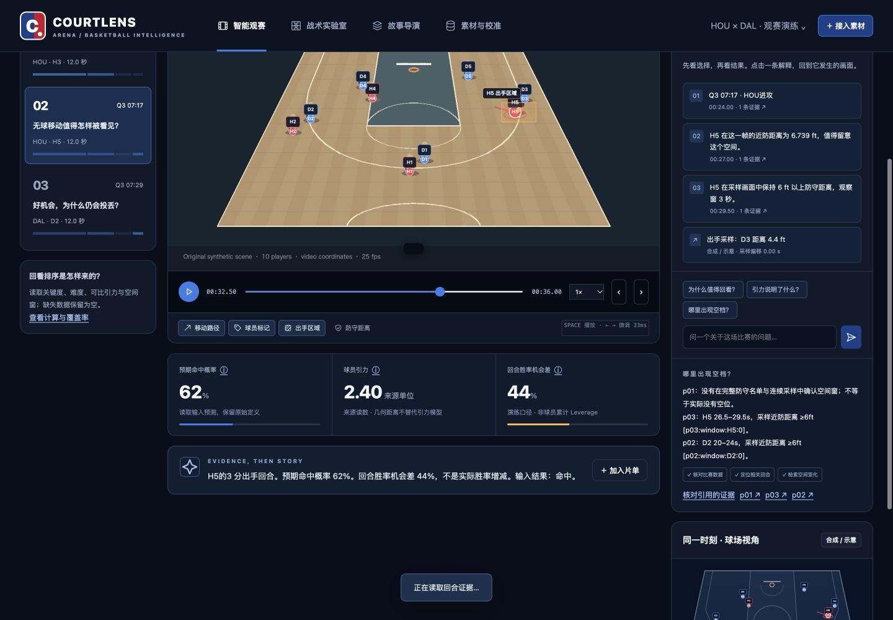

# CourtLens Arena 4.1 · 本地产品版

> **2026-09-28 本地升级已实施。** 本版新增多粒度指标 Adapter v2、动态镜头人工校准、已审 StoryPlan、观众首屏、关键帧证据包和独立 MP4 渲染。优先阅读 [4.1 升级与验收](docs/Arena-4.1-本地升级与验收.md)、[10 页图文演示](docs/CourtLens-Arena-4.1-本地产品验收.pptx)。默认数据与视频是合成演练，真实模型及官方 NBA 素材尚未验收。
>
> 培训后的正式提交需要指定 AWS 环境、CDK、CloudFront 与私有仓库。本地闭环已推进；云资源、正式数据和赛事 Portal 待接入。[新版策略](docs/参赛策略与产品方案.md) · [AWS 迁移](docs/培训后AWS架构与迁移方案.md) · [任务状态](docs/培训后开发任务与验收.md)。本版未推送到历史公开站点，以下公开链接属于早期 v4 演练。

**把篮球深度数据带回比赛画面，让一次出手背后的选择被看见。**



[打开 Arena](https://dingyucanada.github.io/courtlens/) · [18 页产品与参赛方案](docs/CourtLens-Arena-产品与参赛方案.pptx) · [浏览器真实有声成片](media/arena-browser-story.mp4) · [使用与验收](docs/Arena-使用与验收.md) · [下载产品](https://github.com/dingyucanada/courtlens/releases/latest)

Arena 面向篮球观众、分析员和内容创作者，串起视频与数据接入、时间与镜头校准、关键回合分析、逐句证据复核、片单制作和成片交付。采用 NBA 海军蓝、蓝、红、白配色。CourtLens 是独立参赛作品，未获得 NBA 产品认证。

本项目对齐 [CSDN NBA 黑客松赛题](https://builderx.csdn.net/bcast-code#challenge)：读取比赛视频及投篮难度、球员引力、关键度等深度数据，识别关键变化，以箭头、色块和球员标注叠加到原视频，生成对应画面的篮球解说，并交付可运行作品、仓库、文档与演示视频。

**当前随包数据和原始演练视频全部合成。** 官方历史比赛素材与最终字段说明尚待接入；已公布的培训规则见新版策略，具体媒体格式等细则仍待确认；功能测试不代表真实 NBA 分析准确率。默认本地证据引擎实际执行分析与叙事编排，它不是语言模型。可选 Bedrock / Ollama 工具调用接口已实现，真实模型调用与真实 NBA 素材尚未验收。

## 四个工作区

| 工作区 | 可以实际完成的工作 |
| --- | --- |
| **智能观赛** | 逐回合播放、图层开关、普通球迷／专业双视角、指标解释、回看排序与覆盖率、可追溯问答；在“结果揭晓前”冻结时刻，先作选择，再查看后续证据。 |
| **战术实验室** | 同屏比较两个回合、检查近防距离与采样空间窗、查看球场轨迹和证据。不同回合按相对进度比较，不假设它们处于相同战术阶段。 |
| **故事导演** | 将回合加入片单，调整顺序和入出点，编辑逐句解说，添加人工箭头／区域／标签，逐回合复核，连续预览并录制真实视频。 |
| **素材与校准** | 创建独立比赛项目，导入 CSV / JSON 与本地视频，读取视频指纹，映射字段，校正时间，按镜头完成球场平面 4 点标定，保存修订与备份。 |

所有解释都保留来源、时间与证据 ID。缺少指标显示“未提供”，不会用零代替；几何距离与空间窗不冒充官方 Gravity。决策冻结需要有效的出手时刻，缺失或矛盾时不开放，不以回合尾部代替。镜头切换、轨迹缺口、身份不完整和未标定区间会限制对应分析或叠加。

## 开始使用

体验当前 4.1 请在本机启动；[公开 Arena](https://dingyucanada.github.io/courtlens/) 保留早期 v4。首次进入自动载入明确标记的合成演练；已有项目会从当前浏览器恢复。通过“比赛项目”创建自己的比赛，再进入“素材与校准”导入材料。

需要本机成片保存、中文配音或模型接口，在项目根目录运行：

```sh
python3 tools/launch.py --port 8765
```

打开 [本机 Arena](http://127.0.0.1:8765/arena/)。启动器先构建静态文件，再启动仅绑定 `127.0.0.1` 的服务；日常浏览器工作流无需 Node、npm 安装或前端编译。停止服务按 Ctrl+C。

`python3 tools/launch.py --help` 可查看 `--port` 与 `--workspace`。默认本机工作目录为 `workspace/`；原工作台的渲染解释器可用 `COURTLENS_RENDER_PYTHON` 配置。`启动工作台.command` 与 `启动工作台.bat` 也可启动；平台与外部工具的实测范围见 [使用与验收](docs/Arena-使用与验收.md)。

## 从素材到成片

1. **导入并确认来源。** 在“素材与校准”导入最多 16 MiB 的 CSV / JSON、最多 2,000 个回合；绑定浏览器能够解码且不超过 512 MiB 的视频。核对视频与数据是否来自同一原片。SHA-256 证明字节是否一致，不认证 NBA 来源。
2. **核对字段和时间。** 保留指标定义、单位、版本与可用时间。全部工作时间映射为视频秒数；单锚点用于人工确认的固定偏移，多锚点只在已校准范围内分段插值。已在视频时间轴的数据无需重复转换。
3. **按镜头校准。** 画面坐标轨迹可以直接叠加；球场坐标须有有效的镜头标定。在固定镜头按四个地面点顺序建立平面投影，核对坐标轴与实际场地尺寸。切镜头后重新标定，四个拟合点本身不是精度验证。
4. **观看与复核。** 查看逐句证据、回看排序、空间窗与双视角解说；可先冻结出手前时刻作判断。未知值保留未知，人工修改解说和标注会注明来源。
5. **编排和导出。** 在“故事导演”保存片段入出点，检查每句解说与图层，完成当前模式下所有片段的复核，再录制成片。修改内容、绑定不同视频或改变解说模式／图层后需重新复核。
6. **保留交付和原件。** 下载成片、WebVTT、分镜 JSON、可打印 HTML 与项目备份；原视频另行备份。完整字段约定见 [Arena 数据合同](docs/Arena-data-contract.md)。

## 三条成片链路

| 链路 | 输出与条件 | 已验证的范围 |
| --- | --- | --- |
| 浏览器录制 | 真实 WebM，烧录叠加和字幕，默认无原片声音；最多 180 秒，1280 × 720，保持页面前台。 | 实际浏览器录制已接入本机配音、保存和下载；下载文件指纹核对通过。自动测试另覆盖时钟、取消与边界。 |
| 本机配音与保存 | 本机 `say` 的 Tingting + FFmpeg / FFprobe 可选生成 H.264 / AAC MP4；成片可经受控 HTTP 接口保存到本机库。 | 完整实机链路产出 [736,735 字节 MP4](media/arena-browser-story.mp4)：12.008333 秒、300 帧、1280 × 720、H.264 + AAC；非恒定 25 fps。 |
| 可复现离线演示 | Node Canvas 使用与网页相同的 Arena 叠加内核，FFmpeg 生成 MP4，再本机配音。 | 随包 [12 秒有声 MP4](media/arena-story.mp4) 已实际生成并检查：300 帧、25 fps、1280 × 720、H.264 + AAC。这是离线共享内核成片，`browserRecording=false`。 |

随包有声成片使用合成原片和有证据引用的人工精简文句；不代表模型已成功推理。原片音轨未写入；语音按字幕窗编排并适度调速，未声称语音与逐帧画面已经独立精确验证。[浏览器成片校验](docs/arena-assets/browser-export-validation.json) 记录实机录制、配音、保存及下载的完整证据；[离线成片校验](docs/arena-assets/export-validation.json) 独立记录共享内核的离线链路。

离线演示复现需要已安装的 Node、FFmpeg / FFprobe 和中文字体。仅此链路需要 Node Canvas 依赖：

```sh
npm install
node tools/export_arena.mjs --output workspace/arena-silent.mp4
python3 tools/narrate_arena.py --video workspace/arena-silent.mp4 --report workspace/arena-silent.mp4.json --output workspace/arena-voiced.mp4
```

最后一步仅在具有 Tingting 的 macOS 本机可用。自有素材使用导出器的 `--project`、`--video` 与可选 `--font` 参数，运行 `node tools/export_arena.mjs --help` 可查看用法。字幕过密、媒体无效或工具缺失时明确报错。

## 数据保存与运行边界

Arena 的项目、修订和视频 Blob 保存在当前浏览器的 IndexedDB。GitHub Pages 只提供静态应用，不运行 Python、模型或配音服务；导入的视频不会因使用 Pages 而上传。项目在同一浏览器、同一来源地址下延续，线上与 localhost、不同端口、不同浏览器互不共享。

这是一套单用户本机工具，当前没有账号、团队权限、云同步或自动备份。项目 JSON 不含视频字节；更换浏览器、清除网站数据、隐私模式及存储配额可能影响恢复。跨标签页版本冲突会拒绝覆盖；修订恢复形成新版本并撤销复核。

本机 Arena 成片库位于 `workspace/arena_artifacts/`，保存上限为 20 个成片、总计 256 MiB，单次媒体请求不超过 64 MiB；它不保存 Arena 的浏览器项目。静态 Pages 生成的成片只保留在当前页面，下载后再关闭。保存失败会提示下载当前成片，不会伪装已经持久保存。

保留的 [Studio v3](https://dingyucanada.github.io/courtlens/studio.html)、[旧证据演示](https://dingyucanada.github.io/courtlens/demo.html) 和本机 [SQLite / FFmpeg 工作台](http://127.0.0.1:8765/projects.html) 有独立数据合同与存储。它们和 Arena 不自动同步；旧工作台的操作见 [产品使用手册](docs/产品使用手册.md) 与 [产品架构与运维](docs/产品架构与运维.md)。

## 可选模型 Agent

“素材与校准 → Agent 连接与执行”可选择本地证据引擎、本机 Ollama 或 AWS Bedrock。模型模式仅通过本机服务启用；Ollama 固定访问 `127.0.0.1:11434`，需已有支持工具调用的模型。Bedrock 使用已配置 AWS 账户的模型权限与 Python SDK，网页不保存密钥；启用前明确确认结构化证据的发送范围。原视频不随模型请求发送。

模型实际协议是 `search_plays → read_evidence → publish_story`。它只能选择已读取、属于正确回合且在对应时刻可用的声明 ID；本地编译器生成文字与数值，拒绝自由编造答案。输入最多 100,000 字节、问题 1,200 字符，最多 4 轮、8 条声明、12 次工具调用，45 秒截止。

服务端检查结构、有限数值、单位、引用和时序，**不重新测量原视频，也不认证客户端证据真实性**。当前模型协议测试使用模拟提供者，真实 Bedrock / Ollama 调用尚未验收。未配置、超时或非法引用会明确报错，没有用合成回答冒充模型成功的静默降级。

## 验证与发布

2026-09-28 本版实测：Arena 新版 Node 367/367、历史 JavaScript 137/137；Python 198 项中 197 通过、1 跳过（缺随包捕获 WebM 的外部素材项）。启用实际媒体集成测试并生成完整 12 秒 H.264 MP4。浏览器实际导入、解码、编辑、复核、录制、指纹和手机布局另有独立流程记录。详情见 [4.1 升级与验收](docs/Arena-4.1-本地升级与验收.md)；测试数量不代表 NBA 战术识别准确率。原 v4 公开发布与有声链路的历史验收记录仍保留，不充当本版云或官方数据验收。

在项目根目录复现逻辑检查：

```sh
node --test tests/test-pro-*.mjs
node --test site/logic.test.mjs studio/domain.test.mjs studio/export.test.mjs studio/ui-boundaries.test.mjs
node --test tests/*.test.cjs
python3 -m unittest discover -s tests -p 'test_*.py' -v
python3 tests/independent_core.py
python3 tests/independent_media.py
python3 tests/media_export_checks.py
python3 tools/test_site.py
```

媒体和工作台集成检查需要 FFmpeg / FFprobe、Pillow；语音检查另需 macOS `say`。缺失依赖的跳过不算验收通过。Arena 日常浏览器运行无需这些测试工具。

静态发布构建：

```sh
python3 tools/build_site.py --output site-dist --presentation docs/CourtLens-Arena-4.1-本地产品验收.pptx
```

构建根页是 Arena，`studio.html` 保留 Studio，`demo.html` 保留旧证据演示；`pro/` 存放模块，没有独立入口页。发布目录不包含用户视频、数据库、凭据或本机工作区。GitHub Actions 配置了源码及媒体检查；历史 Pages 发布改为手动触发，配置见 [GitHub 发布说明](docs/GitHub发布说明.md)。

## 交付文档

- [Arena 使用与验收](docs/Arena-使用与验收.md)：四工作区、接入校准、复核剪辑、成片、备份和实测边界。
- [Arena 数据合同](docs/Arena-data-contract.md)：字段、指标口径、轨迹、镜头、时间与缺失值处理。
- [科技研究与产品边界](docs/Arena-科技研究与边界.md)：NBA / AWS、Hawk-Eye、Second Spectrum、训练与其他球类的一手资料。
- [18 页产品与参赛方案](docs/CourtLens-Arena-产品与参赛方案.pptx)：真实产品截图、可编辑图表和来源说明。
- [PPT 校验记录](docs/arena-assets/deck-validation.json)、[合成演练统计](docs/arena-assets/deck-demo-statistics.json)、[浏览器有声成片校验](docs/arena-assets/browser-export-validation.json)、[离线成片校验](docs/arena-assets/export-validation.json)。

比赛现场接入时须再核对实际素材许可、指标字典、提交格式、截止时间与允许复用范围。当前实现以可运行、可审计的观看和制作链路为交付边界；不从任意转播自动恢复 NBA 专有追踪和统计模型。
