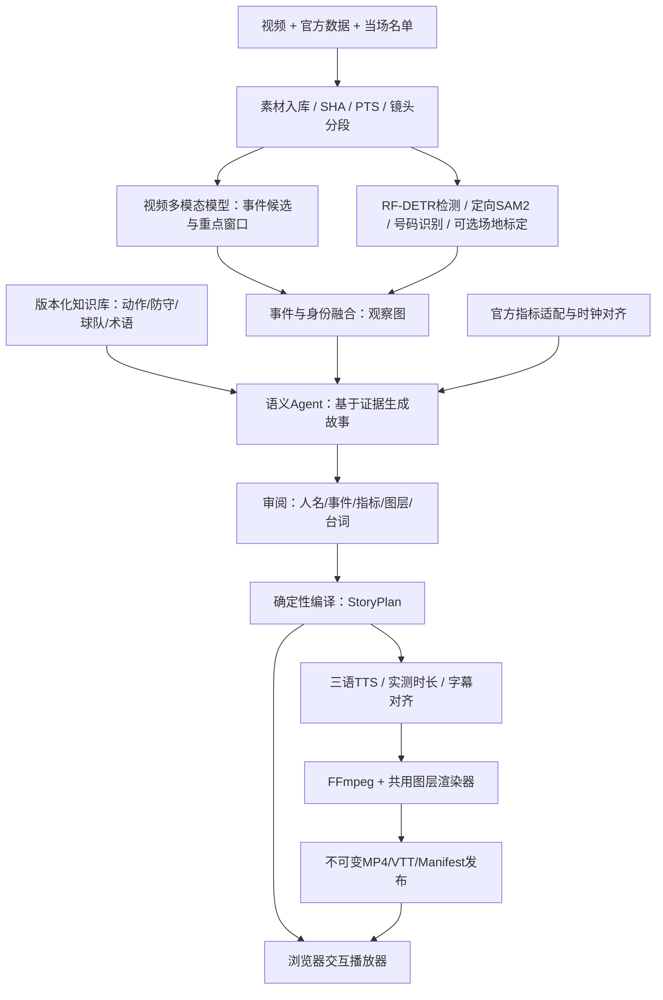
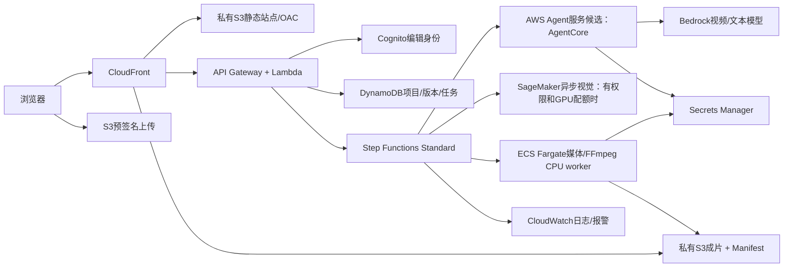

# CourtLens Broadcast｜修正后的技术解决方案

**2026-10-01 · Astra独立审核后实施版 · GPT-6.1 Sol开发，云验收待赛事账户**

本方案取代旧文档中与之冲突的功能优先级、三语限制及视觉方向。旧的已验证媒体、审阅、指标校验、导出代码继续复用。这里的“目标、计划、验收门槛”均不代表已经实现；第 14 节单列实际状态。

## 1. 产品裁决：让观众看懂一次选择

唯一主产品是 **视频解说制作与观看系统**：导入比赛视频和赛方数据，自动提出“谁做了什么、关键选择在哪里、画面和数据能说明什么”，以有限的标注、战术解释和自然语音生成可复核的成片。主入口统一为 `/broadcast/`，保留 CourtLens Broadcast 一套名称和标志。

本轮不做球队管理、训练处方、全赛季BI、预测夺冠、球员评分平台或全场三维数字孪生。专业性来自准确、可追溯、可修改、可导出的完整视频工作流。

### 比赛约束与证据等级

- 用户提供的官方培训纪要：两段训练进攻回合**合计约48秒**，考试一段普通转播视频；18:00发题、20:00硬截止。不是两段各48秒。
- 交付：可运行 Agent、代码、说明、演示视频、含分析叠加的成片与交互网页。
- 硬要求：赛事账户、Portal绑定私有仓库、CDK、CloudFront、指定AWS Agent服务、指定区域、合规素材。具体Agent服务、区域、模型、正式字段以Portal原文确认。
- 评分按用户提供培训材料：机器35、人工55、问答4、投篮6。满足部署要求不等于保证获得35分。
- 本次官网网页抓取失败；赛规依据为用户提供原文和两份已读MD，不把外网失败写成已在线核实。
- MD是建议输入，不是全篇官方规则：其“每段48秒”“所有必须都是赛规”“负引力必然被放空”“缺官方数值可自算替代”等表述不采纳。

## 2. 研究后改变了什么

| 原设想 | 修正后的工程决定 | 原因 |
|---|---|---|
| 做一个丰富的大看板 | 做影片主舞台、制作台、证据侧栏 | 最重要产物是观众能看懂的比赛影片 |
| 整段视频交给模型，一次产出人名、坐标、战术 | 全片理解提出候选；局部视觉取证；结构校验后编译 | 语义、空间、时钟错误需要分别修正 |
| RF-DETR开箱识别所有篮球类别 | 检查实际权重标签表、来源、校验值和样片效果 | 本机现有专项权重只有球员/球/裁判，没有号码和进球类别 |
| SAM2替代身份识别 | SAM2只提供短镜头掩码关联 | 姓名需号码、球队、当场名单和时间证据 |
| SigLIP做OCR | SigLIP用于视觉嵌入/队服聚类；OCR选号码专用分类器或SmolVLM2 | 两类模型的职责不同 [R1] |
| 算法越全越好 | 确保基础闭环，再按质量和资源开启增强 | 初赛最后两小时无法承担临时下载、训练和GPU排障 |
| 千问235B一定支持视频 | 根据精确模型ID探测模态；文本模型仅接收已提取证据 | 参数量不能证明视频支持 |
| 播放中动态变化就是实时AI | 默认先分析，播放时严格同步；实时推理单独标为实验 | 禁止用预计算结果宣称零延迟实时理解 |
| 一个语言对应一个人设 | 语言3项 × 风格3项独立，音色再按可用性选择 | 英语也可以讲战术，粤语也可以讲数据 |
| 用更多AWS服务锁分 | 每个服务有明确职责，不为数量堆架构 | 稳定成片和部署合规优先 |

Roboflow教程给出可复用链路，同时报告T4上约1–2 FPS，且基础OCR与微调OCR存在明显差别。它是很好的起点，但不能当成本项目准确率或实时性能承诺。[R1]

## 3. 对标系统与独创机制

| 对标对象 | 学习什么 | 本项目怎么落地 |
|---|---|---|
| NBA 2K26转播呈现 | 关键时刻的节奏、场馆氛围、解说强弱变化 [R2] | 普通攻防保持安静；出手、协防、关键结果进入短时强调；不复制游戏皮肤 |
| Hudl Studio/Sportscode | 视频时间线、标注、分析工作流 [R3] | 观察卡点击回到对应源帧；编辑与成片分开；允许快速复核 |
| NBA Inside the Game | 专项指标帮助解释画面 [R4] | 数值必须携带官方口径、范围、事件键和来源 |
| 用户提供的Smartshot照片 | 录制→赛中呈现→赛后报告闭环 | 移植工作流结构，不把网球硬件能力当作已拥有的篮球追踪系统 |

比较过三种机制：①全场数据看板：与成片任务弱相关；②全自动逐帧重建：科研和算力风险过大；③**故事驱动的双路取证**：采用。③的独创表达是“选择瞬间”：同一事件在三个视角间切换——**看发生了什么 / 看空间怎样形成 / 看数据如何解释**。三者共享同一视频时钟与证据，不生成另一段虚构比赛。

增强互动“如果协防继续收缩，会出现什么选择？”只显示有画面支持的条件式分支，标为战术解释，不输出无训练验证的成功概率，更不将反事实动画当真录像。

## 4. 用户体验与视觉系统

### 4.1 三个主要界面

**项目入口**：真实影片封面、时长、球队/比赛日期（已确认才显示）、处理状态、继续制作。主CTA“导入比赛视频”。无素材时给清楚的导入路径和明确标注的演练样片，不用假比赛铺满页面。

**制作台**：桌面左侧约68%为16:9影片，右侧32%为当前步骤的工作台。下方是源时间线、事件轨、解说轨和图层轨。任务入口使用“素材、分析、解说、导出”；高级配置收进抽屉。任何跳转都保持源时间，不能切换面板后重载视频。

**观赛影院**：影片优先，底部三段以内故事章节。侧边“此刻为什么”展示一句解释与至多一个主数值；证据按需展开。支持原片/分析层对比、语言/风格、字幕、重看当前事件、全屏。手机把侧栏变成下方卡片，不在小画面上硬塞表单。

### 4.2 视觉规范

- 制作台遵循用户最新选择的 Apple 网站风格：底色 `#F5F5F7`、白色工作区、正文 `#1D1D1F`、辅助字 `#6E6E73`。视频维持深色真实画面；科技感由证据、精确时间和可靠交互体现。
- 操作蓝 `#0071E3`；红色仅用于排除/错误，绿色用于已审核状态；固定用途，禁止同一项在不同页换色。红蓝是品牌色，不默认代表当前比赛两队；球队图例按已确认队服另行标识。
- 一个CourtLens标志；不用NBA官方标志暗示合作。大标题、紧凑时间码、tabular数字、细分隔线；减少圆角卡片层层套叠。
- 图层默认不显示全员方框。当前主角脚下标记/短名牌、一次动作箭头或空间区域、一个核心指标、两行内字幕。
- 动效服务事件：短淡入、事件卡高亮、源时间游标；尊重减弱动画设置。不用随机跳数、雷达扫描、假模型百分比营造科技感。
- 安全区避开原转播记分牌、篮筐和球；移动字幕位置可配置。文字与区域保持可读对比，颜色之外还用线型/标签区分状态。

### 4.3 必须真实可操作

处理阶段显示已完成动作、耗时、错误和重试；不编造进度百分比。任务可取消，取消/旧版本不能覆盖新编辑。断网后已有项目可恢复；无后端的GitHub Pages只能标为预览，不能给上传按钮制造假成功。版本统一：根入口和旧入口引导至当前产品；旧演示只留归档链接。

## 5. 系统架构：共用一条可追溯事件时间线

不是六个彼此自由对话的Agent。采用一个有界编排Agent调用专业工具，最多两次有针对性的补证；长任务由状态机调度。推理失败回到明确的人工校订入口，不能以无限重试掩盖失败。

核心对象：`MediaAsset`、`ShotSegment`、`TrackObservation`、`IdentityCandidate`、`EventObservation`、`OfficialMetricBinding`、`KnowledgeCitation`、`StoryBeat`、`VoiceTrack`、`ReleaseManifest`。每个对象保存输入hash、版本、源PTS、提供者、证据引用、审核状态。模型输出只能成为候选；最终数值和时间合法性由代码校验。

## 6. A层：视觉检测、跟踪、身份和空间

### 6.1 选定管线

1. FFprobe提取真实PTS与流信息；镜头切分结合画面变化和人工核对。回放、特写、转场分别建段。
2. RF-DETR篮球专项权重检测。初步低频扫片只用于选窗；动作窗口内高频处理，采样频率写入证据。
3. 轻量ByteTrack提供初步框关联；关键短窗使用RF-DETR框提示SAM2掩码。切镜必须重置，人物新入镜需重新检测和提示；不得跨剪辑沿用ID。
4. 队服视觉聚类是颜色组，不是球队名。由记分牌/素材元数据/当场名单和人工映射确认球队。
5. 专项号码框→裁图质量筛选→号码OCR/分类。优先专用分类器；SmolVLM2作为可测备选。连续多帧一致性只能增加证据，不能消除一致性误读。
6. 号码+已确认球队+当场名单日期→身份候选。出现重号、换人、号码冲突、低分辨率、不可读时保持未知。禁止“看到独行侠就默认东契奇”。
7. 出手/传球/接球/篮板/结果需视频上下文、多帧与事件定义共同支持；“球在篮筐框附近”不能单独判进球。

### 6.2 球场投影的边界

有至少四个可靠不共线对应点才能求单应性；点应来自场线/固定地面位置。相机移动后逐段或逐帧更新，不能一套四点覆盖整段移动转播。球员位置使用可见接地点；人在空中、脚被遮挡时停用精确地面距离。

本轮先支持人工确认的短时标定与屏幕空间箭头。自动关键点检测须取得适配该转播的权重并过留出集；不过关则不显示米数、精确防守距离或全场战术地图。屏幕空间箭头不必等待地面投影，但必须同镜头、同有效时窗，并注明观察/人工确认来源。

**绝不把二维重建当鹰眼29关键点，也不由自算距离生成官方xFG、GRAV或LVG。**

### 6.3 工程部署

RF-DETR/SAM2/OCR独立视觉worker；锁定代码版本、checkpoint hash、标签表、许可证及预处理。权重预先打包或放私有S3并校验，不在请求或能力检查时下载。

GPU优先候选为SageMaker异步推理；是否可用取决于比赛账号权限/配额。CPU短窗RF-DETR与人工几何是降级路径。Fargate承担CPU媒体任务，不能把GPU版SAM2直接塞进去。[R7][R8]

## 7. B层：视频语义与解说Agent

精确模型由Portal白名单和探测决定：`VideoUnderstandingProvider`、`TextReasoner`、`SpeechProvider`三个接口独立。Bedrock视频模型处理全片或按镜头拼接的语义上下文；千问235B若为文本模型，只消费已提取的观察和知识。

例如Nova Lite/Pro短视频文档说明约1 FPS采样，足够理解大致回合但不足以确定出手帧。使用定向高频帧和CV校验关键瞬间。[R5]

Agent工具最少集：`inspect_media`、`find_event_windows`、`inspect_frames`、`run_cv_window`、`resolve_identity`、`retrieve_tactics`、`bind_metrics`、`propose_story`、`validate_story`。不开放任意shell和任意URL调用。

故事节点最多3个，每个节点包含：

- 发生窗口、主角、可见动作和源帧引用；
- 一句主解释，`fact`或`interpretation`类型；
- 战术概念引用、必要线索、尚缺线索；
- 一个官方主指标及可用时刻，或无指标；
- 一个图层指令及失效条件；
- 三语文案与同一个信息集合。

“为什么传球”使用“协防靠近后，弱侧出现了传球空间”这样的有证据解释。除非有教练/球员明确材料，不宣称读到了心理动机。具名体系如三角进攻、Horns、Spain PnR需要足够动作证据，不因教练历史标签强套本回合。

本轮默认**赛后解读模式**：允许读全片，界面明确标记复盘；每句设availableAt，仅在对应证据时刻显示。这只能防止播放层抢报结果，不能证明模型没有利用后续信息。真正无剧透/直播推理需独立隔离输入、检索及缓存，再做延迟与漏事件评测，不作为本轮交付前置。

## 8. 专业知识库：小而可信，能够实际被检索

### 8.1 分层内容

| 层 | 首版内容与规模目标 | 使用规则 |
|---|---|---|
| 基础动作 | 本轮保留并核验现有10类；扩容依据新片错误分析决定 | 每条有必要线索、排除条件、易混淆动作 |
| 防守应对 | 先覆盖现有条目的防守线索；独立防守目录后续扩展 | 先观察行为，再提出解释 |
| 球队/教练 | 火箭和独行侠、目标视频所属赛季的有日期来源 | 不是永恒球队属性；历史三角进攻为教学材料 |
| 球员身份 | 当场名单、号码、队伍、日期、发音/译名 | 不用现役名单覆盖历史录像 |
| 指标字典 | Portal字段名、单位、粒度、范围、缺失含义 | 未确认字段不自动转单位 |
| 表达知识 | 普通话/英语/粤语术语，三种原创解说风格 | 不保存名人声音、不照搬口头禅 |
| 反例库 | 本轮以实际发现的否定证据、身份混淆、比分滞后等反例优先，不凑固定条数 | 用于模型提示与回归验收 |

每条 `KnowledgeEntry` 保存：ID、类别、中英粤术语、定义、必要动作、反例、来源URL/章节、发布日期、适用赛季/日期、最后核验时间、版本。供应商教程准确率不作为我们自测结果。

### 8.2 检索方式

本轮用可审计JSON和术语索引；数据量增长后再评估SQLite FTS，不因“专业”而强行上向量数据库。按动作标签、队伍、赛季、证据时间过滤后，检索少量概念；后续知识量足够时再测向量重排是否真的提高召回。

输出不仅是文段，还包括 `matchedCues / missingCues / sourceRefs / observationIds / availableAt`。知识引用证明“这种战术如何定义”，视频证据才证明“这次是否发生”。当前语义草稿已接入这类检索，最终发布校验也核对具名战术依据；规则过滤不等于通用语义判真，真实模型仍须逐片审阅。

## 9. C层：数据对齐，不能把排行榜变成现场数值

官方三类数据是权威来源；数值释义按原字典保留。我们修正附件中的四类误用：负引力不直接等于无人防守；低xFG不自动等于精彩/合理；LVG不未经定义就读成胜率百分点；赛季均值不能读成这一次出手的概率。NBA统计术语是字段核验入口。[R4]

`MetricBinding` 必须含 `sourceRecordId, gameId, playerId, eventId, metricCode, value, unit, aggregationScope, eventTime, availableAt, dictionaryVersion, sourceHash`。

视频PTS、比赛节次/倒计时、数据事件时钟是三套时钟。建立逐镜头锚点映射：转播有暂停、剪辑和回放，不能只靠全局时间偏移。相同比赛事件在回放里可能出现两次；回放时间与原事件ID要分别保存。

只有唯一匹配且单位/时间/球员一致的数据进入影片；模糊匹配停留在校订队列。没有逐事件官方数据时，视频仍可讲可见动作，三大数值保持“未提供”；不使用推断值占据官方槽位。背景资料只在背景卡出现，并标清赛季和统计范围。

## 10. D/E/F层：同步叠加、三语声音和真实输出

### 10.1 统一编译

审核后的`StoryPlan`是唯一内容事实源。本轮保留浏览器SVG/CSS与现有Pillow/FFmpeg两端实现；以确定性时间/几何规格及同时间点抽帧校验收敛差异，不声称已经共享所有布局和字幕换行代码。每个图层都有`start,end,segmentId,evidenceRef,coordinateSpace`，超出时窗、切镜、来源改变立即隐藏。

播放使用视频当前PTS驱动，优先`requestVideoFrameCallback`，降级到currentTime；不依靠独立计时器让动画越播越偏。拖动、倍速、暂停、后台恢复都重算可见图层。模型分析结束后才播放成片，不在观赛时重复发模型请求。

### 10.2 三语×三风格

- 语言：普通话`zh-CN`、英语`en-US`、粤语`yue-HK`。
- 风格：**现场派**短句追动作；**战术派**解释选择；**数据派**讲清已绑定的数字。语言不限制风格。
- 原创表达参考已研究的Mike Breen、于嘉、张丕德的表达分工，不克隆或冒称本人声音。
- MiniMax官方接口列出`Chinese`、`English`、`Chinese,Yue`语言增强参数，作为三语首选候选；仍要逐语言、模型、音色实测。StepFun已配置普通话路径继续保留，英文/粤语不能仅依据模型家族宣传启用。[R6]
- 默认只生成所选组合。可先缓存一个风格的三语轨，其他6种按需生成，避免九套音轨拖慢交付。界面只允许选择当前release确实存在的音轨；切换不能假装即时翻译。
- 每句TTS实测时长；优先缩句，其次小幅调速，代码上限1.15倍。装不进窗口则退回编辑，不截断句尾、不抢播结果。语音、字幕及数值来源逐句对应。
- 原声保留并压低，TTS声轨独立；控制削波与突变，预先试听姓名和篮球术语。粤语需要能听懂粤语的人复核自然度，ASR回译只能补助。

### 10.3 交付格式

每次发布保留不可变`releaseId`：H.264/AAC MP4、选定字幕VTT、可用语言音轨、StoryPlan、Manifest及hash。原速影片是必交路径；慢放/停帧若加入必须保存sourcePTS→outputPTS映射，不让数据失去时间依据。

Web切换音轨需统一时基，seek后同步且记录漂移；初版也可切换已生成的各语种MP4并恢复同一时间。未通过媒体同步测试时不做复杂自适应流。播放器与下载文件都验收，不把网页叠加当成已经烧录进MP4。

## 11. AWS架构与部署路径

保留现有CDK的S3、CloudFront、Cognito、API、DynamoDB、Step Functions、Fargate及AgentCore候选实现；先修接口一致性，不重新造同一套基础设施。现有代码没有证明云端可用，也尚未部署SageMaker视觉端点。

- AgentCore仅是当前首选实现。若Portal指定Bedrock Agents等其他服务，替换Agent部署适配器，不声称现有模板已符合要求。
- 本轮将内部业务等待上限设为600秒，外部渲染进程900秒，ECS任务1080秒；这些是故障边界，不是处理速度承诺，云端仍需实测。
- 重媒体操作进worker，HTTP返回jobId。Step Functions等待ECS任务完成；错误写入任务状态，重试有上限。[R9]
- GPU作业独立预算/并发上限；CPU FFmpeg不阻塞Agent请求。没有GPU权限时关闭SAM2增强，仍可走视频理解+轻量检测+人工精确标注。
- S3桶默认私有；编辑需认证，上传URL短期有效、对象键服务端分配；评委只读成片与编辑面分开。素材/成片可公开的范围按比赛许可配置。
- Secrets Manager由服务端读取；浏览器、日志、仓库无密钥。生产日志保留请求ID、hash、耗时和错误类型，不保留Authorization和模型隐含推理。
- Agent、worker、API最小权限，锁定赛事账户/区域。CloudFront为全球服务，区域资源仍在指定区域。自定义域名/跨区域证书本轮不是必需。
- 配置、CDK、容器、数据库表、站点部署在一个工程编排；`cdk synth`只是静态检查，不是正式成功。

部署顺序：①Portal规则/账户/区域/模型原文入档；②STS身份、模型、Agent服务、GPU配额预检；③构建锁版本镜像并跑本地契约；④CDK bootstrap/deploy；⑤上传20秒自有测试片云端全链路；⑥CloudFront浏览器播放/Range/跨端验收；⑦私有仓库绑定确认；⑧提交URL并记录Portal回执。没有赛事AWS账号不能完成④以后；不发布假CloudFront链接。

## 12. 质量验收：以真实片段与反例为准

以下是项目内部目标，不是官方评分细则，也不是已测结果。

| 方面 | 验收方式与收敛条件 |
|---|---|
| 完整闭环 | 上传→自动候选→校订→解说→MP4，刷新/重启恢复；新片不能套旧答案 |
| 人物身份 | 至少10个事件窗作错误发现，报告正确/错误/未知原始计数；最终release可见人名逐条核对；小样本不作泛化精度声明 |
| 事件 | 至少投篮/传球/接球/结果多类型；报告时间误差与漏报误报；粗分析±0.5s，关键锚点逐源帧核对；输出25fps量化误差另列，不混作源帧精度 |
| 几何 | 至少抽查20帧含遮挡/平移/切镜；IoU、ID切换、误跨镜头记录；不可靠图层不进入成片 |
| 官方数值 | 有值均可逆追原记录；无值不造；错球员/错比赛/错单位/错误聚合/回放重计均有拒绝测试 |
| 语义 | 每句事实有来源，每个具名战术有必要线索；不报未发生结果；知识定义与比赛证据分开 |
| 三语 | 相同信息集合、姓名译名统一；实际TTS测时，字幕与语音目标误差≤150ms；粤语自然度单独复核 |
| 播放 | 任意seek、暂停、倍速、原片对比、语言切换后图层与音轨一致；桌面/390px手机无溢出 |
| 可靠性 | API超时、任务重复、用户取消、旧revision、长字幕、破损视频、模型未配置、浏览器断网均可恢复 |
| AWS | 同一赛事账户的CDK部署记录、Agent调用日志、真实CloudFront访问、私有仓库Portal绑定回执齐全 |

性能目标：48秒片段首份粗草稿≤90秒、最终自动处理≤5分钟（不含人工审核）；用实际硬件/区域/冷启动分项记录，未测前不承诺。把耗时拆为上传/解码/语义/CV/TTS/渲染，允许裁剪CV窗口。缓存key包含素材hash、模型/权重、配置、知识库版本、语言和风格，避免换输入仍复用旧答案。

## 13. 八小时实施顺序与收敛线

从指定开发模型可用时开始计实施窗口；这是排程上限，不宣称八小时能完成所有研究级能力。每阶段有可演示产物，失败优先缩减增强功能。

| 时间预算 | 核心任务 | 可验收产物 |
|---|---|---|
| 0–1h | 修复最终校验、锁语言合同；媒体与云容器/任务预算并行预检 | 可回退基线、反例回归、部署缺口 |
| 1–3h | 真片候选→定向取证→人工校订→普通话成片；缺失官方数据降级 | 新请求记录、帧证据、MP4/VTT/manifest |
| 3–4.5h | 完善 Apple 风格制作台/观赛影院，保留视频DOM与时间线联动 | 桌面/390px手机浏览器实测与截图 |
| 4.5–6h | 同场留出诊断、负例、取消恢复；冻结必交功能 | 原始计数与错误报告，不冒充泛化准确率 |
| 6–8h | 账户到达即已开始部署，此段用于云验收；未到则离线/Kiro交接 | 成片、可复现启动、预检记录、已知缺口 |

功能冻结优先级：真实影片闭环 > 事件与数值准确 > 可看懂的叠加 > 自然配音 > 三语全部音色 > SAM2全量/OCR全自动 > 互动分支。任何增强不能拖垮必交片。18:00考试片到达后仅做数据映射/校订/回归/发布，不临时训练新模型；19:30目标冻结候选，保留提交和回退时间。

## 13A. Astra独立审核后的冻结修正（优先于上文扩展计划）

本节记录独立代理以GPT-6 Astra只读审核代码后的裁决；不是外部赛事专家认证。

1. **先堵发布漏洞**：审核复现了人工编辑可绕过模型入口战术约束。具名战术所需证据及条件表述统一在最终story验证执行，覆盖正文、标题、辅助标签，禁止只靠提示词守门。
2. **素材先可进入**：非零PTS、旋转、非方形像素、VFR需在首次导入明确处理；采用保留原片hash及转换日志的标准化副本路径。原始时钟与副本时钟不可混用。30/60fps和VFR反例须测。
3. **部署从第0小时预检**：并行检查镜像、任务预算、Agent接口、上传和Range播放；账号到达即跑最小云链路。第6–8小时用于云验收而非首次尝试部署。
4. **本轮不全面重写渲染器**：网页与MP4暂可使用不同绘制实现，但抽取确定性布局/时间规格并抽帧对齐。保留视频DOM，切换工作面板不得重置影片。
5. **默认赛后复盘**：全片模型看过后续信息，所以“按时显示结果”不等于因果实时推理。真正无未来信息模式暂不作为已实现承诺。
6. **语言与风格解耦，但不预生成九套影片**：旧profile兼容迁移；一个项目一次选择一种语言和风格。普通话先实测；英语、粤语音频在真实合成和试听通过后逐项放行，未配置时可做字幕版。
7. **知识与SAM2收缩**：保留已经核验的10类知识及反例，不为凑24+12条扩库。SAM2仅离线短窗实验，当前5帧2人的可运行记录不作为48秒跟踪验收。身份、球场自动投影不成熟就退回人工确认。
8. **验收看真实闭环**：新片自动提议、手工修正、错误指标拒绝、取消恢复、最终MP4观看/试听都需留证。单元测试通过不能替代这些。

八小时最小交付锁定为：真实新片自动理解项目、1–3个可复核故事节点、人工确认图层、一条普通话配音MP4、VTT、不可变发布记录、可交互页面和部署包。赛事云端资格仍需真实账号/Portal证明。留出片若与开发片同场比赛，只报告同素材分布检验，不称跨比赛泛化。

## 14. 当前实现审计与开发模型交接

**已存在且有本地记录**：真实视频上传与持久化、StepFun视频理解和普通话成片、审阅版本机制、原片叠加MP4/VTT、指标绑定校验、短窗RF-DETR/ByteTrack、CDK离线工程。48秒真实开发片RF-DETR曾处理240采样帧，约34.9秒；这是特定样片耗时，不是身份/战术准确率。

**本轮落地**：统一红蓝制作台与观看页、面板切换不重载视频、三语与三风格独立合同、知识检索进入模型上下文、正文和标签共享战术证据验证、显式媒体标准化工具、独立SAM2短窗实验、云容器知识文件打包修复。最终实测与发布状态以本轮验收记录为准，不复用旧版测试充数。

**留出片审核的负面证据**：Astra先看源帧再比旧模型结果，发现1条投篮结果严重反转、2条明显时间锚点偏差；选定窗口记录9个动作/结果锚点，但不作全片召回率分母。现有自动视觉不能被宣称达到生产准确度；需短窗补证、拒识和人工校订。详见《Broadcast-留出片错误复核-20260930》。

**尚未完成**：稳健自动号码身份识别、自动球场标定、真实三语自然配音验收、官方指标实测、指定AWS账户部署、独立人工精度标注。公开Pages仍是静态演练入口，不是AWS最终交付。

### GPT-6.1 Sol要求

开发执行模型锁定为用户指定的`gpt-6.1-sol`，建议`high`；架构裁决与研究文档先行。官方API文档已确认该模型及high推理档位。[R10] 恢复连接后，当前工具已明确提供该模型。架构经独立审核后，将以该模型启动开发任务；先前候选改动仍按实际执行记录保留，不追溯改称为GPT-6.1 Sol产出。

指定模型的第一项工作是读取本方案、AGENTS.md、未提交diff和现有测试状态，先验证候选再决定保留；不从聊天描述推断已完成。编程模型与产品运行时模型分开：用GPT-6.1 Sol写代码，不代表参赛Agent必须依赖OpenAI API。Kiro若由主办方要求，使用同一Git仓库、标准启动命令、CDK及配置文件接手，不依赖某个IDE私有状态。

## 15. 可核验来源

- R1：[Roboflow篮球检测、SAM2、队伍聚类与号码识别教程](https://blog.roboflow.com/identify-basketball-players/)；[SAM2官方仓库](https://github.com/facebookresearch/sam2)；[Transformers SAM2 Video接口](https://huggingface.co/docs/transformers/en/model_doc/sam2_video)。开源算法和训练权重许可分别核对。
- R2：[2K官方：NBA 2K26转播与场馆呈现](https://newsroom.2k.com/news/latest-presentation-enhancements-bring-lifelike-atmosphere-and-authenticity-to-nba-2k26r)。借鉴原则，不复制画面资产。
- R3：[Hudl Studio官方产品](https://www.hudl.com/products/studio)。借鉴视频分析与标注工作流，不声称性能对等。
- R4：[NBA官方统计术语](https://www.nba.com/news/inside-the-game-stat-glossary)。以Portal原始字典/数据为最终绑定依据。
- R5：[Amazon Nova视频理解文档](https://docs.aws.amazon.com/nova/latest/userguide/modalities-video.html)。具体支持能力按模型ID及当前账号实测。
- R6：[MiniMax同步语音接口](https://platform.minimax.io/docs/api-reference/speech-t2a-http)。语言参数不等于所有音色已通过本项目验收。
- R7：[SageMaker异步推理](https://docs.aws.amazon.com/sagemaker/latest/dg/async-inference.html)。部署须确认权限与实例配额。
- R8：[Fargate任务定义限制](https://docs.aws.amazon.com/AmazonECS/latest/developerguide/fargate-tasks-services.html)。GPU视觉与CPU媒体任务分开。
- R9：[Step Functions调用ECS/Fargate](https://docs.aws.amazon.com/step-functions/latest/dg/connect-ecs.html)；[AgentCore Runtime调用](https://docs.aws.amazon.com/bedrock-agentcore/latest/devguide/runtime-invoke-agent.html)。AgentCore是候选，不代替Portal确认。
- R10：[GPT-6.1 Sol官方模型文档](https://developers.openai.com/api/docs/models/gpt-6.1-sol)；[用户指定发布页](https://openai.com/index/introducing-gpt-6-1-sol/)。官方存在不等于本会话已切换。
- R11：[FIBA篮球术语](https://assets.fiba.basketball/image/upload/documents-corporate-regional-offices-europe-programs-fiba-europe-coaching-certificate-fiba-europe-basketball-terminology.pdf)；[WABC Level 3教练手册](https://assets.fiba.basketball/image/upload/documents-corporate-wabc-coaching-manual-level-3-eng.pdf)。用于知识定义，不证明比赛具体意图。

来源访问日期为2026-09-30。产品边界、排程、测试阈值、数据合同和降级规则属于本项目工程设计，不冒充文献结论或比赛新规。

## 15. 2026-10-01 赛前开发修订：按验收收益排序

这一节覆盖本次用户授权的八小时开发窗口；它不是开赛后云部署的替代验收。完整模块及复现路径见 [赛前模块与验收](Broadcast-赛前模块与验收-20261001.md)。之前已有的影片编译、知识检索、CV worker 和云基础设施继续复用，不把重新包装当作新增能力。

**P0：先修理解与数据的可信链条。** StepFun 每条候选独立校验，非法人名、错源帧、错时间只排除对应行；原始响应在校验前保存在私有任务审计中。整批拒绝进入 needs_review，不能通过能力探针或使已审核内容失效。合法 ID 只证明属于名单，不能证明出现在画面。视觉诊断将真实执行、跨镜头轨迹、单帧事件、未知人物和局部取证失败汇成复核队列；最多两段短窗建议，不自动确认为事实。

**P0：指标准备做成可操作工具。** 原始 CSV/JSON 先检查列，再由操作人明确选择记录、指标、值、事件/出手、发生时刻和独立可用时刻，提供精确版本的指标字典。逐行拒绝错比赛、错球员、错单位、错粒度和错范围；预览不写项目。接受记录数为零的预览不能导入。人工确认导入后保存字段映射、原始行和 hash，清除旧绑定与旧稿。未到达的官方三指标保持未知，不用自算值填槽。

**P1：时钟与画面复核。** 两张已经保存且 hash 匹配的源帧，加同镜头原速比分牌读数，建立局部倒计时→视频 PTS 映射。拒绝停钟、倒行、明显剪辑/慢动作和外推；整数读数保留约一秒的量化不确定度，不能当逐帧精度。前端预览后显式用于对应观察；确认理由保存两锚点读数、时间、不确定度和请求 hash。镜头是否连续仍要核对。

**P1：解说节奏高于音色数量。** 每段同时显示源时窗、文字估时、同版本已有音频的实测值、未知姓名发音和术语资料。文字估时只提示；最终测音频，超窗先缩句，调速上限已收敛为 1.15 倍，不截尾。三语接口、三风格和提供者适配可离线测合同；没有真实英粤音频与母语试听就不标为已验收。

**P1：增加工作台密度。** 保留影片主舞台，事件与解说时间线联动；新增画面核对、解说节奏、提交检查。选事件能循环回看、看引用源帧、提取前后画面；源帧刷新后恢复，附近帧以缩略图选择，其余折叠。切换工作区保留视频 DOM、时间和播放状态。公开视频预览提供原片/分析版对比、12 段时间线和重看当前片段，但仍明确是自制合成演练。

**P2：为 Kiro 与正式资源做交接。** 离线报告只读保存项目，列清本地通过、官方数据未知和四项云/Portal 未验收，不汇总为“全部通过”。新增前端模块与发音字典纳入 CDK 站点包及三个容器的 COPY 清单。账户到达后从身份/区域/Agent 服务/模型权限检查开始，先运行最小云影片，再做比赛素材接入。

**继续延期的增强**：全自动号码识别、无人审核战术预测、全场三维重建、九套声音同时生成，以及持续近实时推理。现有专项检测、SAM2短窗和小样本号码实验只能证明各自运行记录；不能证明 NBA 球员身份或自动解说准确率。本次没有新增外部素材/API测试授权，不重复此前一次受限 StepFun 请求。

独立审核修正：公开成片记录与私有导入审计分离，原始行和未使用指标不发布；来源按记录→字典条目→指标包→字典解析；已生成声音只在展开后的逐句文稿一致时复用时长验收。

## 2026-10-01：现场口播与视觉分析分轨

新的故事仍最多三个视觉分析节点，另有独立 `commentaryCues` 逐动作口播轨（最多60句）。声音说持球、传球、切入、掩护、出手和已确认结果；xFG、引力、LVG以及概率/百分点留在视觉层。每句绑定已接受观察和实际源帧PTS，不得早报结果，不得拿旧事件填满长空白。旧故事可继续播放，新模型若漏口播字段则用保守动作模板，不把分析字幕直接读出来。

默认入口收敛为视频、语言与生成按钮。识别候选集中核对，已审核同语言项目可直接生成；确认动作和最终文稿仍需明确操作，不能把自动审批伪装为人工签收。详细工作台保留在一个入口下。逐句文字与时窗可修改，保存撤销审核，未保存修改不能生成；供应商失败与配音超窗可回到当前句修正。

三语均有原创动作模板与独立音色配置。StepAudio 2.5 使用正式 `instruction` 参数，普通话/英语/粤语各独立库存音色；不存名人声音，不复制标志性台词。音色提示始终要求成片试听，健康探测不代表母语自然度。原片含音轨时仅在口播期间压低原声；不声称已分离现场音与原解说。严格测量每句，仍不截尾、调速不超过1.15倍。

公开36秒合成演示已生成三语真实TTS，每语12句；最长无口播间隔分别约3.40/2.94/3.52秒。网页切换语言保留视频时间，下载文件含普通话、英语、粤语三个AAC音轨。它是合成演练，不是官方NBA数据验收。真实48秒素材继续仅留在本地，补充源帧观察后制作14句现场口播；重复镜头显式提示回看，剪接不解释成连续比赛。真实自动识别准确率、母语听评、官方数值与赛事AWS部署仍待验证。

本轮仅发送原创配音文本给StepFun，不向远程服务发送NBA源片或源帧。接入正式训练/考试素材后，先复测切镜、拒识、身份和事件，再核对官方数值与三语口播。完整自动无人审发布继续延期，不能以不真实解说换取按钮数量更少。

## 2026-10-01：AWS视频路径与赛前工程收敛

按[本轮工程进展](Broadcast-赛前工程进展-20261001.md)执行：视频候选独立校验、最多12动作/32已见帧；模型模态与工具显式声明；分策略探测按配置指纹失效；选定源帧实际发送与云端局部范围修正；切镜候选+真实PTS重点采样；部署证据版本核对。新增切镜和交付检查是独立CLI，不冒充已挂入自动制作或已云验收。优先修视频理解与数据可靠性，再迭代原声音色。云端双模型配置待Portal确认后实现；当前单MODEL_ID不能称视觉模型与Qwen已经同时接通。
