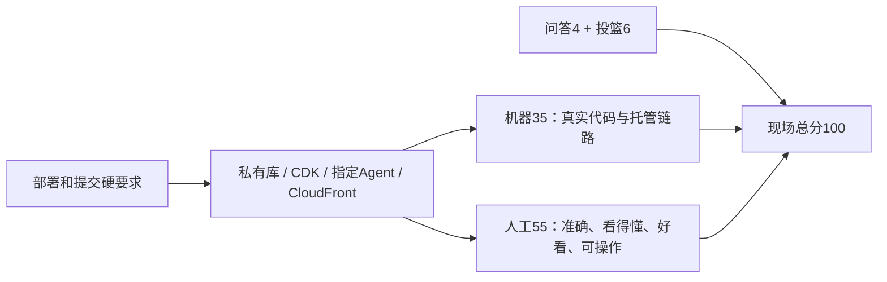

# CourtLens Arena：培训规则对齐

依据2026-09-28 [培训纪要与逐字稿](https://csdn.feishu.cn/docx/FS05dToF1oUmTGxaEjdckPD1nwe) 更新。飞书页面已实际打开，并核对3.4–3.7节云要求；完整核查基于用户所附文字及时间戳。它是线上录音转写整理，不是完整的最终数据字典或提交规范。

原官网概览仍是背景；培训已明确的权重、私有仓库、云要求与截止时间不再标为“未公布”。不明确的服务名、区域和型号继续待核。正式规则、Portal样例和书面更正到达后保留更新记录，不默默覆盖冲突。

## 已确认要求与来源

| 事项 | 培训结论 | 原文位置 |
|---|---|---|
| 核心交付 | 视频输入Agent，输出原视频上的可视化、战术解释成片；解说音轨可加 | 01:05:17、01:05:38、01:07:37 |
| 数据与片段 | 两段训练进攻回合合计约48秒；考试从火箭/独行侠两候选中抽一段；普通直播画面 | 01:08:38；02:09:39 |
| 时间 | 10/10 08:00抽签、18:00考试片、20:00代码和作品URL截止 | 01:08:38、01:19:16、01:36:51、01:49:18 |
| 评分 | 机器35、人工55、知识问答4、24秒投篮6；各大项细分权重未公开 | 01:10:24、01:10:59、01:12:10 |
| 仓库 | GitHub private并绑定Portal，赋予比赛系统所需读取权限；选错需reset | 01:35:46、01:36:51、01:38:51 |
| 云入口 | CloudFront URL；IP、ALB地址或Pages不能替代 | 01:50:30、01:52:15 |
| 基建 | 使用AWS CDK部署到提供的团队账号 | 01:40:27、01:52:15、01:53:09；02:04:10 |
| Agent | 必须部署到AWS Agent服务；具体服务名待核 | 01:53:09、01:53:46 |
| 区域/账号 | 必须指定账号和区域；个人账号仅可练习 | 01:42:54、01:54:51；02:04:10、02:04:21 |
| 数据表达 | 优先预期命中率、持/无球引力、胜负影响；反对数据堆叠 | 01:22:10–01:28:32 |
| 托管服务 | 鼓励合理、多样地使用AWS托管能力；无每服务固定加分表 | 01:53:46、01:54:51 |
| 决赛 | 先技术轮、后效果轮；10/11整体13:30–15:30 | 01:12:43、01:13:05、01:17:44 |
| 允许与纪律 | 可用开源、AI编程和外部API；录像须来源合规；不得滥用账号或干扰平台 | 01:19:16、01:55:43、01:58:26–01:59:47；02:01:22 |

## 待核事项与处理决策

| 未知项 | 不能做的推定 | 获取依据及当前处理 |
|---|---|---|
| AWS Agent服务准确名称 | 把AgentCore、Bedrock Agents、模型API任意视为等价 | 以Portal样例/指南/书面确认为准；优先研究AgentCore，正式部署前确认 |
| 指定区域字符串 | 把转写“美中一”当作已确认us-east-1 | 正式allowedRegion保持未配置；结合Portal配置核验 |
| 两个模型ID与模态 | 猜出“夸我们4.6”，或认定235B支持图像/视频 | sample给出ID后真实能力探测；不凭营销型号承诺视觉理解 |
| 账号开放日 | 把4–5日或7–8日写成硬日期 | 等正式通知；先完成不依赖账号的工作 |
| 原始追踪数据 | 相机采29点就等于会下发29点/10人轨迹 | 接收后做字段与镜头能力清单；无坐标走受审画面标注 |
| 三指标单位/时间粒度 | 用演练0–1 Leverage或赛季平均值代替逐秒值 | 原字段保留，正式字典驱动Adapter与显示 |
| 赛前公开/自有代码复用范围 | 允许开源等于任何预制作品均无条件合规，或直接判定已公开v4违规 | 保留来源与时间，结合指南核对；新开发走私有参赛库 |
| 视频格式、每队路演时长/语言、最终模板 | 自拟1080p/60秒/3分钟当作官方要求 | 团队预设与官方字段分开，公布后逐条验收 |
| 抽签标识的准确格式 | 用残缺转写制造官方模板 | 内部显示Team ID、指定队伍、考试素材ID；最终按指南替换 |
| 队伍数/示例赛季 | 从互相矛盾的数字或口头例子推导比赛规模与素材身份 | 不用于系统配置；以实际分配素材为准 |

## 权重对策略的约束

图示是工作映射，不是各个硬要求单独占多少分，也不代表目前已得分。独立私有参赛库、CloudFront正式入口和AWS运行都尚未落实；现有产品只是一份可复用基线。

本轮改写：[主策略](参赛策略与产品方案.md)、[AWS目标架构](培训后AWS架构与迁移方案.md)、[开发任务](培训后开发任务与验收.md)、[现场手册](现场执行手册.md)、[正式提交清单](规则核验与提交清单.md)。原v4使用手册与测试报告保持其历史版本语义，不改成新架构已实现。
