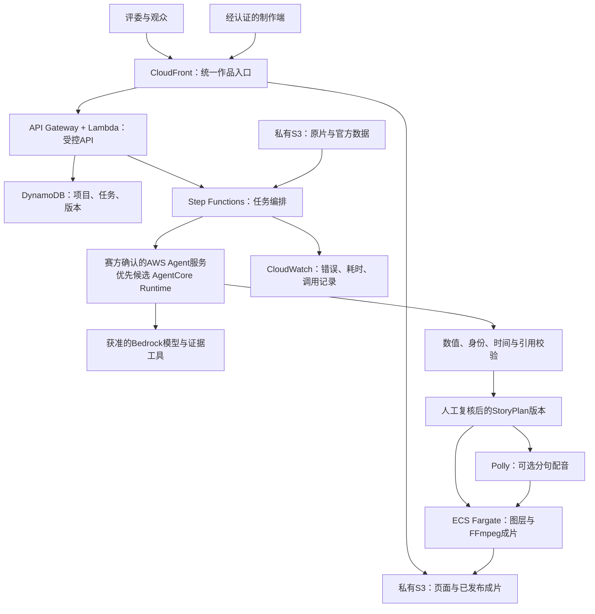

# CourtLens Arena：AWS目标架构与迁移方案

状态：2026-09-28培训后的设计方案，**尚未实施云部署**。指定账号、区域及Agent服务名以Portal正式资料为准。[培训依据](https://csdn.feishu.cn/docx/FS05dToF1oUmTGxaEjdckPD1nwe) 01:40:27–01:55:43。

## 1. 选型决策

以 **Amazon Bedrock AgentCore Runtime 为优先技术候选**，不是认定赛方已经指定它。理由：适合承载当前自定义工具/校验逻辑；AWS提供CDK/CloudFormation资源，可纳入统一部署。[Runtime资源](https://docs.aws.amazon.com/AWSCloudFormation/latest/TemplateReference/aws-resource-bedrockagentcore-runtime.html) · [CDK资源](https://docs.aws.amazon.com/cdk/api/v2/python/aws_cdk.aws_bedrockagentcore/CfnRuntime.html)

本次读取的AWS文档提示 Bedrock Agents Classic不再对新客户开放。因此不能默认用旧版Agents作为新团队账号的可用后备。[AWS说明](https://docs.aws.amazon.com/bedrock/latest/userguide/agents.html) 若Portal明确要求其他服务，以其样例、权限和验收对象重新决策；不得偷偷改成EC2或只有Lambda中的Converse调用并标满足Agent要求。Strands是可选开发框架，不是Agent托管服务本身。

区域候选为 `us-east-1`，但转写不可靠；部署配置 `allowedRegion` 未确认时保持空值并拒绝正式部署。模型ID、跨区域推理策略、视觉能力、工具调用和配额逐项探测，不猜测“夸我们4.6”的型号。

## 2. 架构与职责

| 组件 | 真实任务 | 必须留下的证据 |
|---|---|---|
| CloudFront＋S3 | 分发交互页与已复核成片，原件存储与发布物分开 | 作品URL、源站配置、对象版本、外部播放结果 |
| API Gateway＋Lambda | 输入校验、短期上传授权、任务提交/查询；不跑长视频渲染 | 授权拒绝/成功请求，jobId与错误返回 |
| DynamoDB | 保存项目版本、任务状态、冻结发布清单；条件写避免覆盖 | 同一revision读取、冲突拒绝、重复任务去重 |
| Step Functions Standard | 有限重试、超时、可恢复的阶段任务 | 一次完整执行记录及一次失败路径 |
| Agent服务＋模型 | 当前素材理解、工具调用、证据选择与叙事计划 | 实际资源身份、模型ID、脱敏工具记录、输入/输出哈希 |
| ECS Fargate | 执行已构建渲染容器、叠加自定义图形、编码成片 | 容器镜像摘要、退出状态、输出时长/帧/音轨与版本 |
| Polly（增强） | 不依赖Mac的逐句语音 | 真实可用voice/engine、音频时长与字幕对齐检查 |
| CloudWatch | 定位失败、统计真实耗时和调用量 | 关联jobId/版本的日志；不存密钥 |

托管服务数量不是已知评分公式。只有实际承担任务、能验证运行的服务才进入最终架构。Cognito可用于制作端登录；公开评审仅开放按素材许可允许的只读发布物。无需为一段视频新增OpenSearch、长期记忆、多Agent辩论或实时直播链路。

CloudFront通过OAC读取私有S3源站，不能把输入桶整体公开；OAC保护源站并不自动限制观众访问CloudFront，发布前仍须选择公开许可或访问控制。[AWS OAC说明](https://docs.aws.amazon.com/AmazonCloudFront/latest/DeveloperGuide/private-content-restricting-access-to-s3.html)

Step Functions可编排ECS/Fargate任务。模板还需明确镜像拉取、S3、日志所需网络出口与权限，不把“无公网入站”误认为不需要出站网络。[AWS任务集成](https://docs.aws.amazon.com/step-functions/latest/dg/connect-ecs.html)

## 3. 一条可落地的执行链

1. 制作端上传至原件桶，保存实际字节哈希、素材身份和数据版本。只从允许的对象路径读数据；不让Agent根据用户文本任意访问网络。
2. 分开推理与渲染缓存。推理身份包含原片/数据哈希、字典和观测/标定修订、模型/提示版本及分析参数；修改这些输入即失效。渲染身份包含**已复核StoryPlan内容哈希和revision、图层及源片到输出时间映射、素材哈希、字幕/音频模式与voice/engine等参数、实际音频资产哈希、渲染器/字体/主题/输出配置版本**。人工改错人、改文句、移箭头、关闭语音或调整慢动作都必须产生对应新结果；不得仅因原片没变而复用旧成片。发布清单绑定同一不可变输出。页面区分命中缓存与新推理。
3. 解析时间和镜头；视觉能力可用时读取抽帧/片段，所有球员身份与事件链接保留检查依据。缺乏视觉模型时，不伪造视觉理解成功。
4. Agent调用 `read_metric`、`read_event`、`inspect_frame`、`propose_story` 等限定工具。工具返回标明来源、时间范围和统计粒度的结果；自由推断不能覆盖官方字段。
5. 校验StoryPlan，进入needs_review或ready状态；人工修正有来源。未知指标、漂移轨迹、错误身份或缺证据句子不得直接发布。
6. **启用配音时**，根据每个字幕窗生成语音并实测时长；过长则缩短文句、调整重放节奏或转无配音模式，不按文本均分秒数假装逐句同步。Polly Speech Marks是可选辅助，需验证voice/engine组合支持。[AWS语音标记](https://docs.aws.amazon.com/polly/latest/dg/speechmarks.html)
7. 渲染按输出PTS烧录图层/字幕，启用配音时才合成并核验音轨；字幕版将语音/音轨检查记为不适用，不因没有音轨判为失败。MP4的时长、流信息、首尾画面、逐句时间与证据映射全部检查后发布。MediaConvert仅在需要额外转码/封装时评估，不假设它能直接理解篮球或任意绘制战术。
8. 发布不可变对象并更新一个短缓存release清单；CloudFront页面显示素材ID、revision及成片版本。新任务失败保留前次有效发布，但绝不将训练片伪称考试片。

## 4. CDK交付结构与权限边界

拟新增 `infra/` CDK工程，主栈管理分发、API/数据、Agent与任务资源；代码与依赖锁文件入正式私有仓库。自定义容器和Lambda资产随部署构建，CloudFront URL由栈输出。CDK是通过CloudFormation供应资源的代码工具；仅有模板或synth成功不等于已部署。[CDK定义](https://docs.aws.amazon.com/cdk/v2/guide/home.html)

正式部署前用实际身份与Portal账号逐位核对，禁止默认使用个人profile。区域性资源只能在确认区域；CloudFront/IAM等全局服务按赛方策略处理，不能把CloudFront的全球分发误判为自行跨区部署。推理profile可能跨区路由，需单独核对许可。

不把本机只监听127.0.0.1的Python服务直接开放上公网。写API需认证、对象大小/类型限制、限流与任务配额；浏览器不保存AWS长期密钥。无需外部模型时不创建外部密钥；确需时使用Secrets Manager等受控配置。日志与构建产物排除凭据和完整授权URL。

内部初始限制：渲染并发1、Agent有限轮次/重试、每任务超时、输入大小上限、预算告警与人工停止入口。具体数值在赛方配额/样片性能实测后冻结；不能声称已有每回合成本或端到端耗时。云运行与存储保持到评审和赛方要求的保留期，不在20:00一到就销毁环境。

## 5. 从v4迁移，保留正确的部分

- 复用：原字段保留、事件锚点、引用校验、Canvas画图、导出时钟、编辑与revision规则。
- 改造：IndexedDB作为草稿/缓存，云项目以DynamoDB＋S3版本为准；服务端保存发布状态，评委不依赖作者浏览器。
- 新建：CDK、AWS Agent承载、真实多模态/工具调用、云任务编排、跨平台渲染/语音、制作端认证及发布记录。
- 升级：Leverage通用指标封装，持球/无球Gravity维度，移动镜头校准，官方陌生片验收。
- 降级：关闭错误图层或语音可以保护成片；AWS Agent/CDK/CloudFront缺失仍是正式阻塞，本地备用不能抵消。

发布通路先在练习账号完成可复现验证，正式比赛必须在赛方分配账号重建并实测。未拿到账号时可做CDK本地合成与合成素材容器测试，但结果只记为本地检查。
